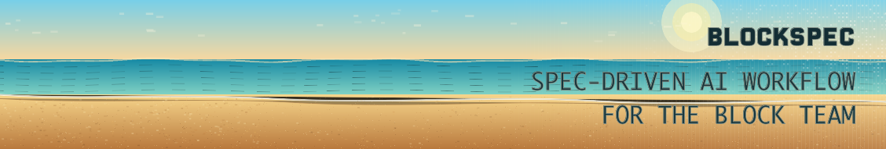

<p align="center">
  
</p>

<p align="center">
  <a href="https://www.npmjs.com/package/@blockdance-lab/blockspec"></a>
  <a href="https://www.npmjs.com/package/@blockdance-lab/blockspec"></a>
  <a href="https://github.com/Hujianboo/OpenSpec/actions/workflows/ci.yml"></a>
  <a href="https://nodejs.org/"></a>
  <a href="LICENSE"></a>
</p>

**Language / 语言:** [English](README.md) · [中文](README.zh-CN.md)

---

> **BlockSpec** — A spec-driven AI workflow tool for the Block team, based on [OpenSpec](https://github.com/Fission-AI/OpenSpec).

**Install BlockSpec from npm**

```bash
npm install -g @blockdance-lab/blockspec   # global CLI (command: blockspec)
npm install @blockdance-lab/blockspec      # add as a project dependency
```

Run `blockspec init` in your repo, then use the same `/opsx:…` slash commands as upstream OpenSpec. The init summary now highlights both Fast Lane entries:

```text
Fast lane for small changes: /opsx:do "your request"
Terminal helper: blockspec quick "your request"
Start your first change: /opsx:propose "your idea"
```

The rest of this README still documents the OpenSpec-style workflow and CLI unless noted here.

### TDD workflow (`tdd` schema)

Start a change with **`/opsx:tdd "<name>"`** (or `blockspec new change "<name>" --schema tdd`). Artifact order: **proposal → specs → test-plan → design → tasks**, then **`/opsx:apply`**. The `tdd` schema adds a **test-plan** phase before design so verification strategy is explicit.

**Preferring human / visual work over automated tests**

BlockSpec does not force everything through unit tests. The pipeline is controlled by how you (or the AI) write three layers:

1. **Specs (`specs/**/spec.md`)** — For behavior you cannot express as a single deterministic assertion (visual polish, motion, device-specific behavior), put **`<!-- manual-verify -->`** immediately after the scenario heading. That marks the scenario as not a default auto-test target.

2. **`test-plan.md`** — Each scenario becomes a verification item. Classify as **`auto-test`** only when you will actually write and maintain an automated test with Setup / Action / Assert. Use **`visual`** when “looks right” is the pass condition (browser, Storybook, screenshots). Use **`manual`** when a human must follow steps on a device or environment. When in doubt and you do not want automation, bias toward **`visual`** or **`manual`** instead of **`auto-test`**.

3. **`tasks.md`** — Task labels drive apply behavior. **`[RED]` / `[GREEN]` / `[REFACTOR]`** mean strict test-first discipline for that slice of work. **`[UI]`** is for styling and layout without an automated assertion. **`[VERIFY]`** is an explicit human checkpoint (describe what to check). To run a change **mostly by human review**, tell the model clearly—for example: *“Put all scenarios under manual-verify where needed; make test-plan mostly visual/manual; use `[UI]` and `[VERIFY]` tasks and avoid `[RED]`/`[GREEN]` except for core logic.”* Only **`[RED]`/`[GREEN]`** tasks require failing tests before implementation; **`[UI]`** and **`[VERIFY]`** do not.

### Default workflow (lighter)

**`/opsx:propose "<name>"`** — **proposal → specs → design → tasks** (no required `test-plan`). Same slash command works under OpenSpec or after `blockspec init`.

### Fast Lane quick mode

Use **`/opsx:do "<small request>"`** when the change is low-risk and you want the assistant to create a minimal record and implement immediately. It creates `quick.md` and `tasks.md` by default, does not require proposal review, and does not run tests unless you add `--verify` or the assistant decides a check is necessary.

Terminal helper:

```bash
blockspec quick "update pricing CTA copy"          # create quick.md/tasks.md, then hand off to /opsx:do
blockspec quick "update pricing CTA copy" --verify # ask the agent to run one lightweight relevant check
blockspec quick "fix typo" --no-record             # no change directory, direct handoff
```

Quick mode sits beside the proposal/apply flow; it does not replace it. It should escalate to `/opsx:propose` for auth, payments, database migrations, permissions, public APIs, broad refactors, unclear requirements, or anything that needs formal review. Recorded quick changes can still be archived; if they have no `specs/` delta files, archive keeps them as history without updating main specs.

→ More on slash workflows: [docs/opsx.md](docs/opsx.md)

<details>
<summary><strong>The most loved spec framework.</strong></summary>

[](https://github.com/Fission-AI/OpenSpec/stargazers)
[](https://www.npmjs.com/package/@fission-ai/openspec)
[](https://github.com/Fission-AI/OpenSpec/graphs/contributors)

</details>
<p></p>
Our philosophy:

```text
→ fluid not rigid
→ iterative not waterfall
→ easy not complex
→ built for brownfield not just greenfield
→ scalable from personal projects to enterprises
```

<p align="center">
  Follow <a href="https://x.com/0xTab">@0xTab on X</a> for updates · Join the <a href="https://discord.gg/YctCnvvshC">OpenSpec Discord</a> for help and questions.
</p>

### Teams

Using OpenSpec in a team? [Email here](mailto:teams@openspec.dev) for access to our Slack channel.

<!-- TODO: Add GIF demo of /opsx:propose → /opsx:archive workflow -->

## See it in action

**Fast Lane** (`quick`): minimal record → implement → summary

```text
You: /opsx:do "rename pricing CTA to Start free trial"
AI:  Created openspec/changes/quick-20260428-pricing-cta/
     ✓ quick.md — request, mode, summary placeholders
     ✓ tasks.md — 3-5 lightweight implementation tasks
     ✓ Updated pricing CTA copy
     No tests run by default quick mode.

You: /opsx:archive quick-20260428-pricing-cta
AI:  Archived as a history-only quick record. No main specs updated.
```

**TDD workflow** (`tdd`): proposal → specs → test-plan → design → tasks

```text
You: /opsx:tdd add-payment-validation
AI:  Created openspec/changes/add-payment-validation/
     ✓ proposal.md  — why we're doing this, what's changing
     ✓ specs/       — GIVEN/WHEN/THEN scenarios, manual-verify markers
     ✓ test-plan.md — auto-test / visual / manual classification
     ✓ design.md    — technical approach + test strategy
     ✓ tasks.md     — [RED]/[GREEN]/[REFACTOR]/[UI]/[VERIFY] labeled tasks
     Ready for test-driven implementation!

You: /opsx:apply
AI:  [RED]    Write failing test: validateCard returns error on invalid number
     [GREEN]  Implement validateCard
     [RED]    Write failing test: validateCard accepts Visa/Mastercard
     [GREEN]  Handle card type check
     [REFACTOR] Extract card type constants
     [UI]     Style error message component  ← visual inspection
     [VERIFY] Manual: test on real device   ← manual checkpoint
     All tasks complete!
```

**Default workflow** (`spec-driven`): proposal → specs → design → tasks

```text
You: /opsx:propose add-dark-mode
AI:  Created openspec/changes/add-dark-mode/
     ✓ proposal.md — why we're doing this, what's changing
     ✓ specs/       — requirements and scenarios
     ✓ design.md    — technical approach
     ✓ tasks.md     — implementation checklist
     Ready for implementation!

You: /opsx:apply
AI:  Implementing tasks...
     ✓ 1.1 Add theme context provider
     ✓ 1.2 Create toggle component
     ✓ 2.1 Add CSS variables
     ✓ 2.2 Wire up localStorage
     All tasks complete!

You: /opsx:archive
AI:  Archived to openspec/changes/archive/2025-01-23-add-dark-mode/
     Specs updated. Ready for the next feature.
```

<details>
<summary><strong>OpenSpec Dashboard</strong></summary>

<p align="center">
  
</p>

</details>

## Quick Start

**Requires Node.js 20.19.0 or higher.**

Install BlockSpec globally:

```bash
npm install -g @blockdance-lab/blockspec@latest
```

Then navigate to your project directory and initialize:

```bash
cd your-project
blockspec init
```

After init, use **`/opsx:do <small-request>`** for Fast Lane implementation, or prepare the same path from the terminal with **`blockspec quick "<small-request>"`**. Use **`/opsx:tdd <what-you-want-to-build>`** for test-driven development, or **`/opsx:propose <what-you-want-to-build>`** for the default planned workflow.

If you want the expanded workflow (`/opsx:new`, `/opsx:continue`, `/opsx:ff`, `/opsx:verify`, `/opsx:sync`, `/opsx:bulk-archive`, `/opsx:onboard`), select it with `openspec config profile` and apply with `openspec update`.

> [!NOTE]
> Not sure if your tool is supported? [View the full list](docs/supported-tools.md) – we support 25+ tools and growing.
>
> Also works with pnpm, yarn, bun, and nix. [See installation options](docs/installation.md).

## Docs

→ **[Getting Started](docs/getting-started.md)**: first steps<br>
→ **[Workflows](docs/workflows.md)**: combos and patterns<br>
→ **[Commands](docs/commands.md)**: slash commands & skills<br>
→ **[CLI](docs/cli.md)**: terminal reference<br>
→ **[Supported Tools](docs/supported-tools.md)**: tool integrations & install paths<br>
→ **[Concepts](docs/concepts.md)**: how it all fits<br>
→ **[Multi-Language](docs/multi-language.md)**: multi-language support<br>
→ **[Customization](docs/customization.md)**: make it yours


## Why OpenSpec?

AI coding assistants are powerful but unpredictable when requirements live only in chat history. OpenSpec adds a lightweight spec layer so you agree on what to build before any code is written.

- **Agree before you build** — human and AI align on specs before code gets written
- **Stay organized** — each change gets its own folder with proposal, specs, design, and tasks
- **Work fluidly** — update any artifact anytime, no rigid phase gates
- **Use your tools** — works with 20+ AI assistants via slash commands
- **Choose your discipline** — `tdd` for test-first engineering (test-plan + task labels), `spec-driven` for lightweight iteration

### How we compare

**vs. [Spec Kit](https://github.com/github/spec-kit)** (GitHub) — Thorough but heavyweight. Rigid phase gates, lots of Markdown, Python setup. OpenSpec is lighter and lets you iterate freely.

**vs. [Kiro](https://kiro.dev)** (AWS) — Powerful but you're locked into their IDE and limited to Claude models. OpenSpec works with the tools you already use.

**vs. nothing** — AI coding without specs means vague prompts and unpredictable results. OpenSpec brings predictability without the ceremony.

## Updating OpenSpec

**Upgrade the package**

```bash
npm install -g @fission-ai/openspec@latest
```

**Refresh agent instructions**

Run this inside each project to regenerate AI guidance and ensure the latest slash commands are active:

```bash
openspec update
```

## Usage Notes

**Model selection**: OpenSpec works best with high-reasoning models. We recommend Opus 4.5 and GPT 5.2 for both planning and implementation.

**Context hygiene**: OpenSpec benefits from a clean context window. Clear your context before starting implementation and maintain good context hygiene throughout your session.

## Contributing

**Small fixes** — Bug fixes, typo corrections, and minor improvements can be submitted directly as PRs.

**Larger changes** — For new features, significant refactors, or architectural changes, please submit an OpenSpec change proposal first so we can align on intent and goals before implementation begins.

When writing proposals, keep the OpenSpec philosophy in mind: we serve a wide variety of users across different coding agents, models, and use cases. Changes should work well for everyone.

**AI-generated code is welcome** — as long as it's been tested and verified. PRs containing AI-generated code should mention the coding agent and model used (e.g., "Generated with Claude Code using claude-opus-4-5-20251101").

### Development

- Install dependencies: `pnpm install`
- Build: `pnpm run build`
- Test: `pnpm test`
- Develop CLI locally: `pnpm run dev` or `pnpm run dev:cli`
- Conventional commits (one-line): `type(scope): subject`

## Other

<details>
<summary><strong>Telemetry</strong></summary>

OpenSpec collects anonymous usage stats.

We collect only command names and version to understand usage patterns. No arguments, paths, content, or PII. Automatically disabled in CI.

**Opt-out:** `export OPENSPEC_TELEMETRY=0` or `export DO_NOT_TRACK=1`

</details>

<details>
<summary><strong>Maintainers & Advisors</strong></summary>

See [MAINTAINERS.md](MAINTAINERS.md) for the list of core maintainers and advisors who help guide the project.

</details>


## License

MIT
